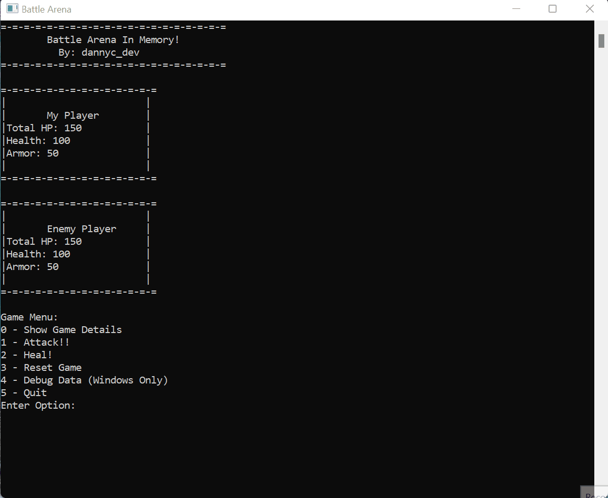
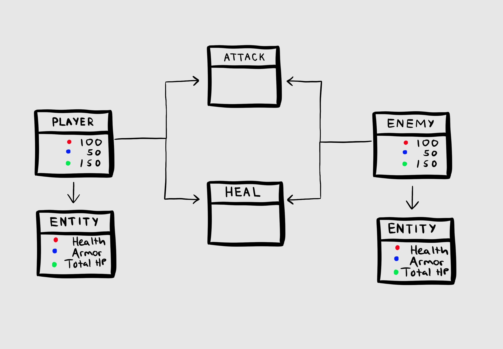

### Battle Arena Game

A simple command line turn based RNG game. Used as a prototype to explore static pointer offsets in a game programming setting. 

More information about the external trainer built for this game can be found here: https://github.com/dannyc-dev/Battle-Arena-Trainer. 

Full blog about this project can be found here: https://dannyc.io/blogs/battle-arena

Game Preview:  

Design overview:  

